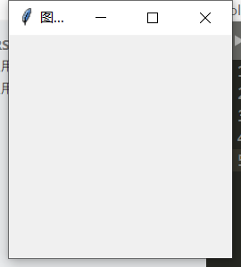
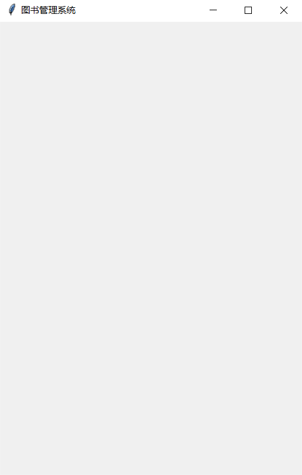
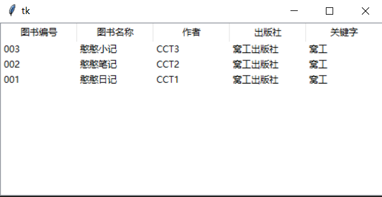
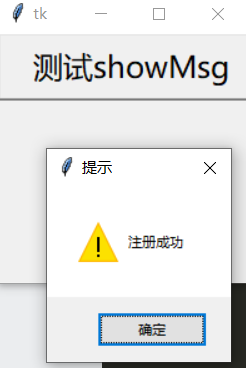
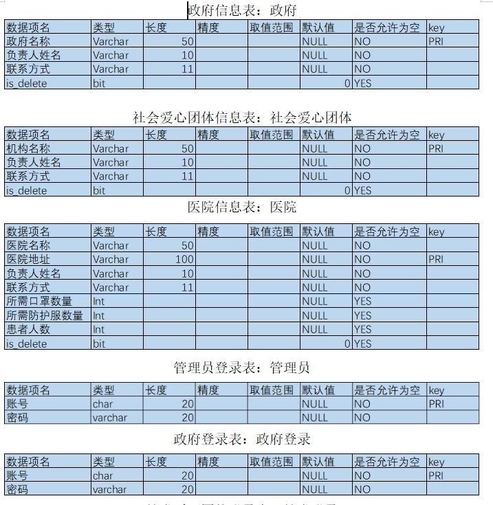
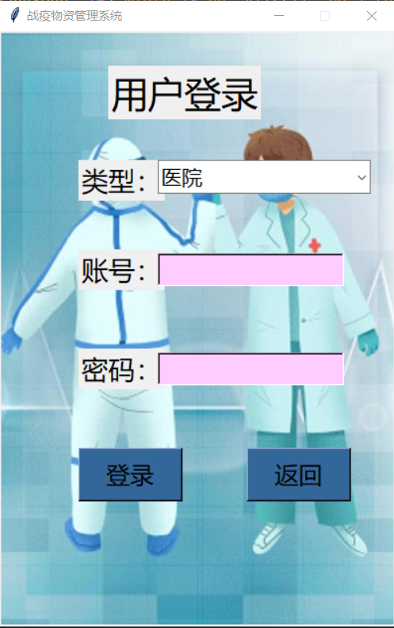
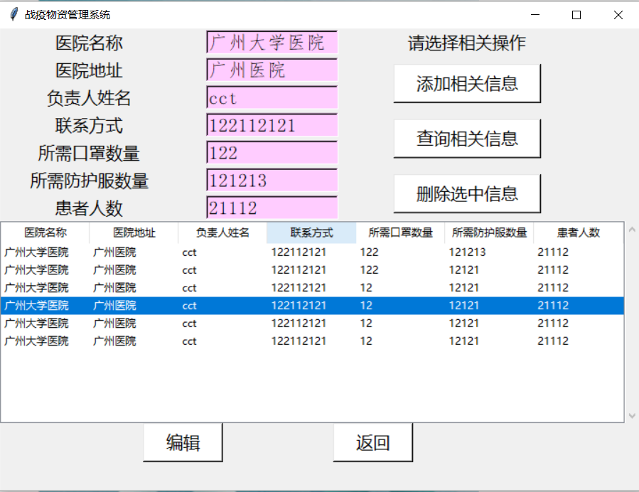
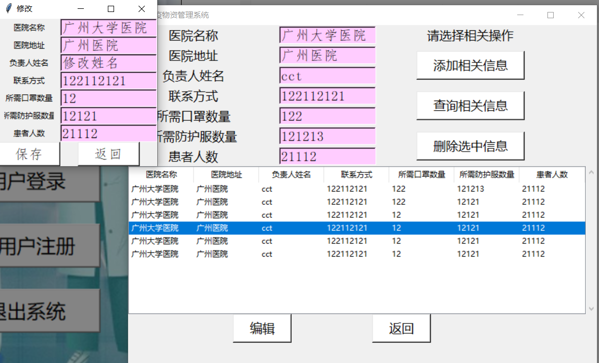

### python链接数据库(窗体程序)

#### 一、 pymssql链接数据库

```pip install pymssql```

​	pymssql链接数据库的方法十分简单。但是需要有数据库的相关数据。

```python
# 先导入这个包，前提是电脑有SQL server和SSMS
import pymssql

# 与数据库链接需要的参数，不同的电脑链接的参数不一样
# 请确保 sa 在SSMS中已经激活
server = "DESKTOP-ONRD7KJ"
database = "store-test"
user = "sa"
password = "123456"

# 链接数据库
conn = pymssql.connect(server, user, password, database)
# 创建游标
cursor = conn.cursor()
# 执行游标中的相关语句
cursor.execute('select * from goods')
# 取出一行
row = cursor.fetchone()
print(row)
# 关闭游标和链接
cursor.close()
conn.close()
```

#### 二、 Tkinter介绍

 ##### 2.1 Tk()介绍

```python
# 主窗体循环
from tkinter import *
root = Tk()
root.title("图书管理系统")
root.mainloop()
```

  	上述是一个基本的窗体，仅仅只需要四行代码变能够看到一个简单的窗体，我们所需要的做的，就是学习相关的控件，并且将控件放置在对应的位置，这样就能够做出一个比较漂亮的窗体程序。如图所示：



  	在上述窗体中，我们看到，该窗体设置了标题，但是标题的显示却没有办法显示完全，这是由于窗体的默认尺寸过小，所以才没有办法完全显示，并且，窗体出现的位置是在屏幕的左上角，这并不是特别合适。下面这串代码很好地解决了这个问题。

```python
from tkinter import *

# 设置固定高度
width = 400
height = 600

root = Tk()
root.title("图书管理系统")

# 获取窗体
screen_width, screen_height = root.maxsize()
align_str = "%dx%d+%d+%d" % (width, height, (screen_width-width)/2, (screen_height-height)/2)

root.geometry(align_str)
root.mainloop()
```

   	运行上述代码，可以看到，窗体的大小比较合适，而且出现的位置在屏幕的正中央。这样我们就创建了一个简单的窗体，接下来的任务，就是给窗体润色，添加相应的功能即可。(上述调整窗体大小和位置的代码比较固定，如果觉得不合适，只需要修改width和height即可，调整到自己喜欢的大小即可)

  	 窗体如下：



  给窗体添加背景图片:
		由于窗体的背景是白色的，这样比较丑，我们可以借助python中的PIL库来使得窗体更加美观，可以使用以下代码来美化窗体。

```python
from tkinter import *
# ———————————————————————— 新增代码 ————————————————————————
from PIL import Image,ImageTk

def get_image(filename,width,height):
	im = Image.open(filename).resize((width,height))
	return ImageTk.PhotoImage(im)
# ———————————————————————— 新增代码 ————————————————————————

width = 400
height = 600

root = Tk()
root.title("图书管理系统")
screen_width, screen_height = root.maxsize()
align_str = "%dx%d+%d+%d" % (width, height, (screen_width-width)/2, (screen_height-height)/2)

# ———————————————————————— 新增代码 ————————————————————————
canvas_root = Canvas(root,width=400, height=600)
# 需要寻找一张图片，与py文件放置在同一目录下，并且图片命名为图书图片.jpg
im_root = get_image("图书图片.jpg", 400, 600)
canvas_root.create_image(200,300, image=im_root)
canvas_root.pack()
# ———————————————————————— 新增代码 ————————————————————————

root.geometry(align_str)
root.mainloop()
```

​		新的代码与原来的代码所不同的地方在于，使用了PIL中的Image和ImageTk 两个函数，请读者对比一下上述代码与原来代码的不同，对对应的函数加以研究。


##### 2.2 标签和按钮控件

​     先看以下代码：

```python
from tkinter import *
from PIL import Image,ImageTk

def get_image(filename,width,height):
	im = Image.open(filename).resize((width,height))
	return ImageTk.PhotoImage(im)

# 新增代码 ————————————————————————
def testButton():
	print("测试按钮按了一下")
# 新增代码 ————————————————————————
	
width = 400
height = 600

root = Tk()
root.title("图书管理系统")
screen_width, screen_height = root.maxsize()
align_str = "%dx%d+%d+%d" % (width, height, (screen_width-width)/2, (screen_height-height)/2)

canvas_root = Canvas(root,width=400, height=600)
im_root = get_image("图书图片.jpg", 400, 600)
canvas_root.create_image(200,300, image=im_root)
canvas_root.pack()

# ———————————————————————— 新增代码 ————————————————————————
title_label = Label(root, text="图书信息管理系统",font=("Microsoft Yahei",28))
title_label.place(x=45,y=35)

mg_login_btn = Button(root, text="测试按钮",font=("Microsoft Yahei",18),command=testButton,padx=20)
mg_login_btn.place(x=120,y=150)
# ———————————————————————— 新增代码 ————————————————————————

root.geometry(align_str)
root.mainloop()
```

   代码运行结果


​	在上述新增代码中，我们可以看到，使用了Label标签和Button按钮。

```title_label = Label(root, text="图书信息管理系统",font=("Microsoft Yahei",28))```

```title_label.place(x=45,y=35)```

​    参数1： root , 指明窗体，  	text:   指明标签文本，     font: 字体，这里需要注意，需要写成元组形式， 28为font-size

​    第二行代码为指明放置位置， 以窗体左上角为原点， 右边为x轴， 下边为y轴。

```btn = Button(root, text="测试按钮",font=("Microsoft Yahei",18),command=testButton,padx=20)```

```btn.place(x=120,y=150)```

​	参数1:    root , 指明窗体，		text: 指明按钮文本，  font:字体，同上，  command： 点击时触发的函数事件，padx： 横轴内填充

​	上述代码如果不需要临时变量来存储对应的控件的话，那也可以用一行代码来实现对应的功能。

​	```Label(root, text="图书信息管理系统",font=("Microsoft Yahei",28)).place(x=45,y=35)```

```Button(root, text="测试按钮",font=("Microsoft Yahei",18),command=testButton,padx=20).place(x=120,y=150)```

##### 2.3 输入框

​		为了说明输入框，将代码简化了一下，如下所示：

```python
from tkinter import *
root = Tk()

def getContent():
	text = user_name_text.get()
	print(text)

user_name_text = StringVar()
user_name_entry = Entry(root, font=('FangSong',20), width=13,bg="#ffccff",bd=2,textvariable=user_name_text)
user_name_entry.place(x=10,y=10)

Button(root,text="测试按钮",font=('FangSong', 16), command=getContent).place(x=10,y=50)

root.mainloop()
```

​		运行结果如下：


使用输入框的步骤如下：

​	1、 定义输入框的内容  user_name_text = StringVar()

​	2、 使用Entry控件，需要指定  textvariable=user_name_text 

​	3、 放置好Entry控件的位置

##### 2.4 TreeView控件(重点)

​		有了上述代码的基础，我们就需要用到TreeView控件，来实现对数据库中读取到的数据的显示。

```python
from tkinter import *
from tkinter import ttk
root = Tk()

tree = ttk.Treeview(root, show="headings") #表格第一列不显示
tree.grid(row=5, columnspan=4)
tree["columns"] = ("#1", "#2", "#3","#4","#5")
tree.column("#1", width=100)
tree.column("#2", width=100)
tree.column("#3", width=100)
tree.column("#4", width=100)
tree.column("#5", width=100)
tree.heading("#1", text="图书编号")
tree.heading("#2", text="图书名称")
tree.heading("#3", text="作者")
tree.heading("#4", text="出版社")
tree.heading("#5", text="关键字")

# 模拟数据库插入数据:
value1 = ["001", "憨憨日记", "CCT1", "窝工出版社", "窝工"]
value2 = ["002", "憨憨笔记", "CCT2", "窝工出版社", "窝工"]
value3 = ["003", "憨憨小记", "CCT3", "窝工出版社", "窝工"]
tree.insert("",0,text="",values=value1)
tree.insert("",0,text="",values=value2)
tree.insert("",0,text="",values=value3)

def getItem():
	print(tree.selection())
	print(tree.item(tree.selection())['values'])

Button(root,text="保存",font=('FangSong',16),command=getItem,padx=18,bg="white").place(x=0, y=100)
root.mainloop()

```

运行结果如下：



这样，就实现了对相关数据的显示，那么，如何获取选中的那一行呢？

我们同样使用Button进行测试，这时候，我们可以看到控制台已经输出了我们所选择的内容。

##### 2.5 messagebox控件

```
from tkinter import *
from tkinter import messagebox
root =Tk()

def showMsg():
	messagebox.showwarning(title="提示", message="注册成功")

Button(root, text="测试showMsg",font=("Microsoft Yahei",18),command=showMsg,padx=18)
root.mainloop()
```

​	代码运行结果如下：



##### 2.6 Combobox控件

​	Combobox控件是做下拉菜单的，用户可以根据自己的选择，下拉菜单。

```
from tkinter import *
from tkinter import ttk
from tkinter.ttk import Combobox

root = Tk()
menu_value = StringVar()
menu_list = ['医院', '政府', '社会人士及爱心团体']
menu_comb = Combobox(root, textvariable=menu_value,width=16,values=menu_list,state="readonly",font=("Microsoft Yahei",16))
menu_comb.current(0)
menu_comb.place(x=160,y=130)

root.mainloop()
```

  代码运行结果如下：


下一步，只需要根据获取menu_value的值即可。

#### 三、增删改查的思路

##### 3.1 增加

```"insert into dbo.表名 values('%s','%s','%s')"% (text1,text2,text1)```

根据对应需要添加的数据库表，对字符串进行拼接即可。

##### 3.2 修改

```UPDATE dbo.表名 SET text1='%s',text2='%s',text3='%s' where text1= '%s' and text2 = '%s' and text3 = '%s';''' % temp_tuple```

其中temp_tuple应该是一个含有6个值的元组。

##### 3.3 查询

这里需要特别说明的是，模糊查询的实现方式，我们可以把表中有的一些字段名存储在表格中，根据表格的信息去组织数据，对数据进行拼接。

比如，我们设计了一个图书的表字段，这里我们就可以使用下面的方式来进行模糊查询。

```python
dict_value = ("and 图书编号 like '%{}%' ",
              "and 图书名称 like '%{}%' ",
              " and 作者 like '%{}%'",
              " and 出版社 like '%{}%' ",
              " and 关键字 like '%{}%' ")
query = "insert into dbo.图书信息表 values ('%s','%s','%s','%s','%s')" % 
(book_text,name_text,contact_phone,password,key_word)
```




```python
from tkinter import *
from tkinter import ttk
from tkinter import messagebox
from tkinter.ttk import Combobox
from PIL import Image,ImageTk
import pymssql
# 1.设置窗口的大小并居中显示
width = 400
height = 600

server = "DESKTOP-ONRD7KJ"
database = "mydb"
user = "sa"
password = "123456"

conn = pymssql.connect(server,user,password,database)
cursor = conn.cursor()

def get_image(filename,width,height):
	im = Image.open(filename).resize((width,height))
	return ImageTk.PhotoImage(im)

# 主窗体登录界面
class LoginPage:
	def __init__(self):

		self.root = Tk()
		screen_width, screen_height = self.root.maxsize()

		# 2.设置窗体在屏幕中央
		align_str = "%dx%d+%d+%d" % (width, height, (screen_width-width)/2, (screen_height-height)/2)
		self.root.geometry(align_str)
		self.root.title("战疫物资管理系统")

		# 3.设置背景图片
		self.canvas_root = Canvas(self.root,width=400, height=600)
		im_root = get_image("窗体背景.jpg", 400, 600)
		self.canvas_root.create_image(200,300, image=im_root)
		self.canvas_root.pack()

		# 4.主界面相关标题
		self.title_label = Label(self.root, text="战疫物资管理系统",font=("Microsoft Yahei",28))
		self.title_label.place(x=45,y=35)

		# 5.主界面按钮设置
		self.mg_login_btn = Button(self.root, text="管理员登录",font=("Microsoft Yahei",18),command=self.managerLogin,padx=20)
		self.mg_login_btn.place(x=120,y=180)

		self.user_login_btn = Button(self.root,text="用户登录",font=("Microsoft Yahei",18),command=self.userLogin,padx=32)
		self.user_login_btn.place(x=120,y=260)

		self.new_login_btn = Button(self.root, text="新用户注册", font=("Microsoft Yahei",18),command=self.register,padx=20)
		self.new_login_btn.place(x=120,y=340)

		self.logout_btn = Button(self.root, text="退出系统",font=("Microsoft Yahei",18),command=self.exitSystem,padx=32)
		self.logout_btn.place(x=120,y=420)

		self.root.resizable(width=False,height=False)

		self.root.mainloop()

	def managerLogin(self):
		self.root.destroy()
		mg = ManagerLogin()

	def userLogin(self):
		self.root.destroy()
		user = UserLoginPage()

	def register(self):
		self.root.destroy()
		reg = RegisterLogin()

	def exitSystem(self):
		self.root.destroy()


# 管理员登录界面
class ManagerLogin:
	def __init__(self):
		self.manager_page = Tk()
		screen_width, screen_height = self.manager_page.maxsize()

		# 2.设置窗体在屏幕中央
		align_str = "%dx%d+%d+%d" % (width, height, (screen_width-width)/2, (screen_height-height)/2)
		self.manager_page.geometry(align_str)
		self.manager_page.title("战疫物资管理系统")

		# 3.设置背景图片
		self.canvas_root = Canvas(self.manager_page,width=400, height=600)
		im_root = get_image("窗体背景.jpg", 400, 600)
		self.canvas_root.create_image(200,300, image=im_root)
		self.canvas_root.pack()
		self.manager_page.resizable(width=False,height=False)
		# 4.主界面相关标题
		self.title_label = Label(self.manager_page, text="管理员登录",font=("Microsoft Yahei",28))
		self.title_label.place(x=110,y=35)
		

		# 数据1
		self.user_name_label = Label(self.manager_page, text="账号：",font=("Microsoft Yahei",20))
		self.user_name_text = StringVar()
		self.user_name_entry = Entry(self.manager_page, font=('FangSong',20), width=13,bg="#ffccff",bd=2,textvariable = self.user_name_text)

		# 数据2
		self.password_label = Label(self.manager_page, text="密码：",font=("Microsoft Yahei",20))
		self.password_text = StringVar()
		self.password_entry = Entry(self.manager_page, font=('FangSong',20),width=13,bg="#ffccff",bd=2,textvariable = self.password_text,show="*")


		self.login_btn = Button(self.manager_page, text="登录",font=("Microsoft Yahei",18),command=self.login_test,padx=18,bg="#336699")
		self.login_btn.place(x=80,y=420)

		self.back_btn = Button(self.manager_page, text="返回",font=("Microsoft Yahei",18),command=self.backToRoot,padx=18,bg="#336699")
		self.back_btn.place(x=250,y=420)

		self.user_name_label.place(x=80,y=200)
		self.user_name_entry.place(x=160,y=204)
		self.password_label.place(x=80,y=300)
		self.password_entry.place(x=160,y=304)
		self.manager_page.mainloop()

	def backToRoot(self):
		self.manager_page.destroy()
		lp = LoginPage()


	def login_test(self):
		info = self.get_login_info()
		user_name = self.user_name_text.get()
		password = self.password_text.get()
		print(info)
		if user_name in info.keys():
			if password == info[user_name]:
				messagebox.showwarning(title="提示", message="登录成功")
				self.manager_page.destroy()
				MS = ManageSearch()
				print("登录成功!")
			else:
				messagebox.showwarning(title="提示", message="密码错误")
				print("密码错误!")
		else:
			messagebox.showwarning(title="提示", message="用户名错误")
			print("用户名错误")


	# 这里负责获取登录的账号和密码，最终返回一个字典
	def get_login_info(self):
		query = "select * from dbo.管理员登录表"
		cursor.execute(query)
		ret = {}
		row = cursor.fetchone()
		while row:
			ret[row[0].rstrip()] = row[1]
			row = cursor.fetchone()
			print(row)
		print(ret)
		return ret

# 用户登录界面
class UserLoginPage:
	def __init__(self):
		self.user_page = Tk()
		screen_width, screen_height = self.user_page.maxsize()

		# 2.设置窗体在屏幕中央
		align_str = "%dx%d+%d+%d" % (width, height, (screen_width-width)/2, (screen_height-height)/2)
		self.user_page.geometry(align_str)
		self.user_page.title("战疫物资管理系统")

		# 3.设置背景图片
		self.canvas_root = Canvas(self.user_page,width=400, height=600)
		im_root = get_image("窗体背景.jpg", 400, 600)
		self.canvas_root.create_image(200,300, image=im_root)
		self.canvas_root.pack()
		self.user_page.resizable(width=False,height=False)
		# 4.主界面相关标题
		self.title_label = Label(self.user_page, text="用户登录",font=("Microsoft Yahei",28))
		self.title_label.place(x=110,y=35)
		
		self.choose_label = Label(self.user_page, text="类型：",font=("Microsoft Yahei",20))
		self.choose_label.place(x=80,y=130)
		# 5.下拉菜单
		self.menu_value = StringVar()
		menu_list = ['医院', '政府', '社会人士及爱心团体']
		self.menu_comb = Combobox(self.user_page, textvariable=self.menu_value,width=16,values=menu_list,state="readonly",font=("Microsoft Yahei",16))
		self.menu_comb.current(0)
		self.menu_comb.place(x=160,y=130)
		# 数据1
		self.user_name_label = Label(self.user_page, text="账号：",font=("Microsoft Yahei",20))
		self.user_name_text = StringVar()
		self.user_name_entry = Entry(self.user_page, font=('FangSong',20), width=13,bg="#ffccff",bd=2,textvariable=self.user_name_text)

		# 数据2
		self.password_label = Label(self.user_page, text="密码：",font=("Microsoft Yahei",20))
		self.password_text = StringVar()
		self.password_entry = Entry(self.user_page, font=('FangSong',20),width=13,bg="#ffccff",bd=2,textvariable=self.password_text,show="*")


		self.login_btn = Button(self.user_page, text="登录",font=("Microsoft Yahei",18),command=self.login_test,padx=18,bg="#336699")
		self.login_btn.place(x=80,y=420)

		self.back_btn = Button(self.user_page, text="返回",font=("Microsoft Yahei",18),command=self.backToRoot,padx=18,bg="#336699")
		self.back_btn.place(x=250,y=420)

		self.user_name_label.place(x=80,y=220)
		self.user_name_entry.place(x=160,y=224)
		self.password_label.place(x=80,y=320)
		self.password_entry.place(x=160,y=324)
		self.user_page.mainloop()

	def backToRoot(self):
		self.user_page.destroy()
		lp = LoginPage()

	def login_test(self):
		part = self.menu_value
		print(part.get())
		info = self.get_login_info(part)
		user_name = self.user_name_text.get()
		password = self.password_text.get()
		print(info)
		if user_name in info.keys():
			if password == info[user_name]:
				messagebox.showwarning(title="提示", message="登录成功")
				print("登录成功!")
				if part.get()=="医院":
					self.user_page.destroy()
					mh = ManagerHos(2)
				elif part.get()=="政府":
					self.user_page.destroy()
					cp = ChoosePage(0,self.user_name_text.get())
				else:
					self.user_page.destroy()
					cp = ChoosePage(2,self.user_name_text.get())

			else:
				messagebox.showwarning(title="提示", message="密码错误")
				print("密码错误!")
		else:
			messagebox.showwarning(title="提示", message="用户名错误")
			print("用户名错误")


	# 这里负责获取登录的账号和密码，最终返回一个字典
	def get_login_info(self,part):
		print(part.get())
		if(part.get()=="医院"):
			query = "select * from dbo.医院登录表"
		elif(part.get()=="政府"):
			query = "select * from dbo.政府登录表"
		else:
			query = "select * from dbo.社会爱心团体登录表"
		cursor.execute(query)
		ret = {}
		row = cursor.fetchone()
		while row:
			ret[row[0].rstrip()] = row[1]
			row = cursor.fetchone()
			print(row)
		print(ret)
		return ret

# 用户注册界面
class RegisterLogin:
	def __init__(self):
		self.regLogin = Tk()
		screen_width, screen_height = self.regLogin.maxsize()

		# 2.设置窗体在屏幕中央
		align_str = "%dx%d+%d+%d" % (width, height, (screen_width-width)/2, (screen_height-height)/2)
		self.regLogin.geometry(align_str)
		self.regLogin.title("战疫物资管理系统")

		# 3.设置背景图片
		self.canvas_root = Canvas(self.regLogin,width=400, height=600)
		im_root = get_image("窗体背景.jpg", 400, 600)
		self.canvas_root.create_image(200,300, image=im_root)
		self.canvas_root.pack()
		self.regLogin.resizable(width=False,height=False)

		self.title_label = Label(self.regLogin, text="新用户注册",font=("Microsoft Yahei",28))
		self.title_label.place(x=110,y=35)
		
		self.choose_label = Label(self.regLogin, text="类型：",font=("Microsoft Yahei",20))
		self.choose_label.place(x=80,y=130)
		# 5.下拉菜单
		self.menu_value = StringVar()
		menu_list = ['医院', '政府', '社会人士及爱心团体']
		self.menu_comb = Combobox(self.regLogin, textvariable=self.menu_value,width=16,values=menu_list,state="readonly",font=("Microsoft Yahei",16))
		self.menu_comb.current(0)
		self.menu_comb.place(x=160,y=130)

		# 数据1
		self.user_name_label = Label(self.regLogin, text="账号：",font=("Microsoft Yahei",20))
		self.user_name_text = StringVar()
		self.user_name_entry = Entry(self.regLogin, font=('FangSong',20), width=13,bg="#ffccff",textvariable=self.user_name_text,bd=2)

		# 数据2
		self.password_label = Label(self.regLogin, text="密码：",font=("Microsoft Yahei",20))
		self.password_text = StringVar()
		self.password_entry = Entry(self.regLogin, font=('FangSong',20),width=13,bg="#ffccff",bd=2,textvariable=self.password_text,show="*")

		self.user_name_label.place(x=80,y=220)
		self.user_name_entry.place(x=160,y=224)
		self.password_label.place(x=80,y=320)
		self.password_entry.place(x=160,y=324)


		self.login_btn = Button(self.regLogin, text="注册",font=("Microsoft Yahei",18),command=self.register,padx=18,bg="#336699")
		self.login_btn.place(x=80,y=420)

		self.back_btn = Button(self.regLogin, text="返回",font=("Microsoft Yahei",18),command=self.backToRoot,padx=18,bg="#336699")
		self.back_btn.place(x=250,y=420)

		self.regLogin.mainloop()

	def backToRoot(self):
		self.regLogin.destroy()
		lp = LoginPage()

	def register(self):
		part = self.menu_value.get()
		user_name = self.user_name_text.get()
		password = self.password_text.get()

		self.write_in_sql(part,user_name,password)

	def write_in_sql(self,part,user_name,password):
		print(part)
		print(user_name)
		print(password)
		values = (user_name, password)
		if(part == "医院"):
			query = "insert into dbo.医院登录表 values (%s,%s)"
		elif(part == "政府"):
			query = "insert into dbo.政府登录表 values (%s,%s)"
		else:
			query = "insert into dbo.社会爱心团体登录表 values (%s,%s)"
		cursor.execute(query,values)
		conn.commit()
		messagebox.showwarning(title="提示", message="注册成功")
		self.backToRoot()

# 管理员选择界面
class ManageSearch:
	def __init__(self):
		self.searchPage = Tk()
		screen_width, screen_height = self.searchPage.maxsize()

		# 2.设置窗体在屏幕中央
		align_str = "%dx%d+%d+%d" % (width, height, (screen_width-width)/2, (screen_height-height)/2)
		self.searchPage.geometry(align_str)
		self.searchPage.title("战疫物资管理系统")

		# 3.设置背景图片
		self.canvas_root = Canvas(self.searchPage,width=400, height=600)
		im_root = get_image("窗体背景.jpg", 400, 600)
		self.canvas_root.create_image(200,300, image=im_root)
		self.canvas_root.pack()
		self.searchPage.resizable(width=False,height=False)

		self.title_label = Label(self.searchPage, text="欢迎您，管理员",font=("Microsoft Yahei",28))
		self.title_label.place(x=75,y=35)

		self.wel_label = Label(self.searchPage, text="请选择数据库类型",font=(("Microsoft Yahei",20)))
		self.wel_label.place(x=90,y=135)

		self.login_hos_btn = Button(self.searchPage, text="医院",font=("Microsoft Yahei",18),command=self.login_hos,padx=18,bg="#336699")
		self.login_hos_btn.place(x=145,y=220)

		self.login_gov_btn = Button(self.searchPage, text="政府",font=("Microsoft Yahei",18),command=self.login_gov,padx=18,bg="#336699")
		self.login_gov_btn.place(x=145,y=310)

		self.login_soc_btn = Button(self.searchPage, text="社会人士及爱心团体",font=("Microsoft Yahei",18),command=self.login_soc,padx=18,bg="#336699")
		self.login_soc_btn.place(x=60,y=400)

		self.back_btn = Button(self.searchPage, text="返回",font=("Microsoft Yahei",18),command=self.back_to_login,padx=18,bg="#336699")
		self.back_btn.place(x=145,y=490)

		self.searchPage.mainloop()

	def login_hos(self):
		self.searchPage.destroy()
		mh = ManagerHos(1)

	def login_gov(self):
		self.searchPage.destroy()
		gm = GovManage(1)

	def login_soc(self):
		self.searchPage.destroy()
		sm = SocManage(1)

	def back_to_login(self):
		self.searchPage.destroy()
		ML = ManagerLogin()

# 医院界面
class ManagerHos:
	def __init__(self,value,text=""):
		self.value = value
		self.text = text
		self.ManagerHosPage = Tk()
		self.ManagerHosPage.title("战疫物资管理系统")
		# 测试模糊查询
		self.dict_value = ("and 医院名称 like '%{}%' ","and 医院地址 like '%{}%' ","and 负责人姓名 like '%{}%' ",
					"and 联系方式 like '%{}%' ","and 所需口罩数量 >= {} ","and 所需防护服数量 >= {} ","and 患者人数 >= {} ")
		screen_width, screen_height = self.ManagerHosPage.maxsize()
		width_hos=720
		height_hos=520
		# 2.设置窗体在屏幕中央
		align_str = "%dx%d+%d+%d" % (width_hos, height_hos, (screen_width-width)/2, (screen_height-height)/2)
		self.ManagerHosPage.geometry(align_str)
		Label(self.ManagerHosPage, text="医院名称",font=("Microsoft Yahei",14)).grid(row=0,column=0)
		Label(self.ManagerHosPage, text="医院地址",font=("Microsoft Yahei",14)).grid(row=1,column=0)
		Label(self.ManagerHosPage, text="负责人姓名",font=("Microsoft Yahei",14)).grid(row=2,column=0)
		Label(self.ManagerHosPage, text="联系方式",font=("Microsoft Yahei",14)).grid(row=3,column=0)
		Label(self.ManagerHosPage, text="所需口罩数量",font=("Microsoft Yahei",14)).grid(row=4,column=0)
		Label(self.ManagerHosPage, text="所需防护服数量",font=("Microsoft Yahei",14)).grid(row=5,column=0)
		Label(self.ManagerHosPage, text="患者人数",font=("Microsoft Yahei",14)).grid(row=6,column=0)
		self.var1 = StringVar()
		self.var2 = StringVar()
		self.var3 = StringVar()
		self.var4 = StringVar()
		self.var5 = StringVar()
		self.var6 = StringVar()
		self.var7 = StringVar()
		Entry(self.ManagerHosPage, font=('FangSong',16),width=13,bg="#ffccff",bd=2,textvariable=self.var1).grid(row=0,column=1)
		Entry(self.ManagerHosPage, font=('FangSong',16),width=13,bg="#ffccff",bd=2,textvariable=self.var2).grid(row=1,column=1)
		Entry(self.ManagerHosPage, font=('FangSong',16),width=13,bg="#ffccff",bd=2,textvariable=self.var3).grid(row=2,column=1)
		Entry(self.ManagerHosPage, font=('FangSong',16),width=13,bg="#ffccff",bd=2,textvariable=self.var4).grid(row=3,column=1)
		Entry(self.ManagerHosPage, font=('FangSong',16),width=13,bg="#ffccff",bd=2,textvariable=self.var5).grid(row=4,column=1)
		Entry(self.ManagerHosPage, font=('FangSong',16),width=13,bg="#ffccff",bd=2,textvariable=self.var6).grid(row=5,column=1)
		Entry(self.ManagerHosPage, font=('FangSong',16),width=13,bg="#ffccff",bd=2,textvariable=self.var7).grid(row=6,column=1)
		Label(self.ManagerHosPage, text="请选择相关操作",font=("Microsoft Yahei",14)).grid(row=0,column=2)
		Button(self.ManagerHosPage, text="添加相关信息",font=("Microsoft Yahei",14),command=self.add_item,padx=18,bg="white").grid(row=1,column=2,rowspan=2)
		Button(self.ManagerHosPage, text="查询相关信息",font=("Microsoft Yahei",14),command=self.get_like_item,padx=18,bg="white").grid(row=3,column=2,rowspan=2)
		Button(self.ManagerHosPage, text="删除选中信息",font=("Microsoft Yahei",14),command=self.del_item,padx=18,bg="white").grid(row=5,column=2,rowspan=2)
		self.tree = ttk.Treeview(self.ManagerHosPage, show="headings") #表格第一列不显示
		self.tree.grid(row=7, columnspan=4)
		self.tree["columns"] = ("#1", "#2", "#3","#4","#5","#6","#7")
		# 设置列，不显示
		self.tree.column("#1", width=100)
		self.tree.column("#2", width=100)
		self.tree.column("#3", width=100)
		self.tree.column("#4", width=100)
		self.tree.column("#5", width=100)
		self.tree.column("#6", width=100)
		self.tree.column("#7", width=100)
		# 显示表头
		self.tree.heading("#1", text="医院名称")
		self.tree.heading("#2", text="医院地址")
		self.tree.heading("#3", text="负责人姓名")
		self.tree.heading("#4", text="联系方式")
		self.tree.heading("#5", text="所需口罩数量")
		self.tree.heading("#6", text="所需防护服数量")
		self.tree.heading("#7", text="患者人数")		

		# self.tree.insert("", i, text="", values=(ii, "3", addurl, aa))
		self.insert_into_tree(self.get_item())
		"""
		    定义滚动条控件
		    orient为滚动条的方向，vertical--纵向，horizontal--横向
		    command=tree.yview 将滚动条绑定到treeview控件的Y轴
		"""
		#scroll_ty = Scrollbar(root, orient=VERTICAL, command=tree.yview)
		#scroll_ty.grid(row=1, column=1, sticky=N+S)
		#tree['yscrollcommand']=scroll_ty.set

		# ----vertical scrollbar------------
		vbar = ttk.Scrollbar(self.ManagerHosPage, orient=VERTICAL, command=self.tree.yview)
		self.tree.configure(yscrollcommand=vbar.set)
		#tree.grid(row=0, column=0, sticky=NSEW)
		vbar.grid(row=7, column=4, sticky=NS)

		# ----horizontal scrollbar----------
		# hbar = ttk.Scrollbar(self.ManagerHosPage, orient=HORIZONTAL, command=self.tree.xview)
		# self.tree.configure(xscrollcommand=hbar.set)
		# hbar.grid(row=8, column=0, sticky=EW)

		Button(self.ManagerHosPage, text="编辑",font=("Microsoft Yahei",14),command=self.edit_item,padx=18,bg="white").grid(row=8,column=0,columnspan=2)
		Button(self.ManagerHosPage, text="返回",font=("Microsoft Yahei",14),command=self.back_btn,padx=18,bg="white").grid(row=8,column=1,columnspan=2)

		self.ManagerHosPage.mainloop()
	
	def insert_into_tree(self, info_list):
		for row in info_list:
			self.tree.insert("",0,text="",values=row)

	def get_item(self,values=()):
		if (values==()):
			query = "select * from dbo.医院信息表 where is_delete = 0;"
			info_list = list()
			cursor.execute(query)
			row = cursor.fetchone()
			while row:
				info_list.append(row)
				row = cursor.fetchone()
			print(info_list)
			return info_list

		else:
			print(values)
			query = "select * from dbo.医院信息表 where is_delete = 0 "
			info_list = list()
			i = 0
			for data in values:
				if(data != "" and i<4):
					query += self.dict_value[i].format(data)
				elif(data != "" and i>=4):
					query += self.dict_value[i].format(int(data))
				else:
					i = i + 1
					continue
				i = i + 1
			cursor.execute(query)
			row = cursor.fetchone()
			while row:
				info_list.append(row)
				row = cursor.fetchone()
			print("*"*50)
			print(query)
			return info_list

	def del_item(self):
		temp_list = self.tree.item(self.tree.selection())['values']
		query = '''UPDATE dbo.医院信息表 SET is_delete=1 where 医院名称 = '%s' and 医院地址 = '%s' and 负责人姓名 = '%s' and 联系方式 = '%s' 
		and 所需口罩数量 = %s and 所需防护服数量 = %s and 患者人数 = %s;'''% (temp_list[0],temp_list[1],temp_list[2],temp_list[3],temp_list[4],temp_list[5],temp_list[6])
		print("*"*50)
		print(query)
		cursor.execute(query)
		conn.commit()
		messagebox.showwarning(title="提示",message="删除成功")
		self.tree.delete(self.tree.selection())

	def add_item(self):
		hos_name = self.var1.get()
		hos_addr = self.var2.get()
		user_name = self.var3.get()
		user_contact = self.var4.get()
		need_mask = self.var5.get()
		cloth_num = self.var6.get()
		per_num = self.var7.get()
		if(need_mask!=""): need_mask = int(need_mask)
		if(cloth_num!=""): cloth_num = int(cloth_num)
		if(per_num!=""): per_num = int(per_num)
		query = "insert into dbo.医院信息表 values('%s','%s','%s','%s',%s,%s,%s,%s)"% (hos_name,hos_addr,user_name,user_contact,need_mask,cloth_num,per_num,0)
		print(query)
		print("-"*50)
		try:
			if hos_name != "" and hos_addr != "" and user_name !="" and user_contact != "":
				cursor.execute(query)
				conn.commit()
			else:
				messagebox.showwarning(title="提示",message="输入不能为空")
		except:
			messagebox.showwarning(title="提示", message="地址不能重复")
			print("录入失败")
		self.refresh()

	def get_like_item(self):
		hos_name = self.var1.get()
		hos_addr = self.var2.get()
		user_name = self.var3.get()
		user_contact = self.var4.get()
		need_mask = self.var5.get()
		cloth_num = self.var6.get()
		per_num = self.var7.get()
		if(need_mask!=""): need_mask = int(need_mask)
		if(cloth_num!=""): cloth_num = int(cloth_num)
		if(per_num!=""): per_num = int(per_num)
		values = (hos_name,hos_addr,user_name,user_contact,need_mask,cloth_num,per_num)
		self.refresh(values)

	def back_btn(self):
		self.ManagerHosPage.destroy()
		if (self.value==1):
			MS = ManageSearch()
		elif(self.value==2):
			cp = ChoosePage(self.value,self.text)
		else:
			cp = ChoosePage(self.value,self.text)

	def refresh(self,values=()):
		records = self.tree.get_children()
		for element in records:
			self.tree.delete(element)
			# print(element)
			print("*"*50)
		self.insert_into_tree(self.get_item(values))


	def edit_item(self):
		top = Toplevel()
		top.title("修改")
		init_list = self.tree.item(self.tree.selection())['values']
		Label(top, text="医院名称", width=10).grid(row=0,column=0)
		Label(top, text="医院地址", width=10).grid(row=1,column=0)
		Label(top, text="负责人姓名", width=10).grid(row=2,column=0)
		Label(top, text="联系方式", width=10).grid(row=3,column=0)
		Label(top, text="所需口罩数量", width=10).grid(row=4,column=0)
		Label(top, text="所需防护服数量", width=10).grid(row=5,column=0)
		Label(top, text="患者人数", width=10).grid(row=6,column=0)
		temp_var1 = StringVar()
		temp_var2 = StringVar()
		temp_var3 = StringVar()
		temp_var4 = StringVar()
		temp_var5 = StringVar()
		temp_var6 = StringVar()
		temp_var7 = StringVar()
		temp_var1.set(init_list[0])
		temp_var2.set(init_list[1])
		temp_var3.set(init_list[2])
		temp_var4.set(init_list[3])
		temp_var5.set(init_list[4])
		temp_var6.set(init_list[5])
		temp_var7.set(init_list[6])
		Entry(top, font=('FangSong',16),width=13,bg="#ffccff",bd=2,textvariable=temp_var1).grid(row=0,column=1)
		Entry(top, font=('FangSong',16),width=13,bg="#ffccff",bd=2,textvariable=temp_var2).grid(row=1,column=1)
		Entry(top, font=('FangSong',16),width=13,bg="#ffccff",bd=2,textvariable=temp_var3).grid(row=2,column=1)
		Entry(top, font=('FangSong',16),width=13,bg="#ffccff",bd=2,textvariable=temp_var4).grid(row=3,column=1)
		Entry(top, font=('FangSong',16),width=13,bg="#ffccff",bd=2,textvariable=temp_var5).grid(row=4,column=1)
		Entry(top, font=('FangSong',16),width=13,bg="#ffccff",bd=2,textvariable=temp_var6).grid(row=5,column=1)
		Entry(top, font=('FangSong',16),width=13,bg="#ffccff",bd=2,textvariable=temp_var7).grid(row=6,column=1)
		temp_list = self.tree.item(self.tree.selection())['values']
		def back():
			top.destroy()

		def save():
			temp_modify = []
			temp_modify.append(temp_var1.get())
			temp_modify.append(temp_var2.get())
			temp_modify.append(temp_var3.get())
			temp_modify.append(temp_var4.get())
			temp_modify.append(temp_var5.get())
			temp_modify.append(temp_var6.get())
			temp_modify.append(temp_var7.get())
			temp_tuple = []
			for i in temp_modify:
				temp_tuple.append(i)
			for j in init_list:
				print(j)
				temp_tuple.append(j)
			temp_tuple.pop()
			temp_tuple = tuple(temp_tuple)
			query = '''UPDATE dbo.医院信息表 SET 医院名称='%s',医院地址='%s',负责人姓名='%s',联系方式='%s',所需口罩数量=%s,所需防护服数量=%s, 患者人数=%s where 医院名称 = '%s' and 医院地址 = '%s' and 负责人姓名 = '%s' and 联系方式 = '%s' and 所需口罩数量 = %s and 所需防护服数量 = %s and 患者人数 = %s;''' % temp_tuple
			print(query)
			cursor.execute(query)
			conn.commit()

			if(temp_modify == temp_list):
				back()
			else:
				messagebox.showwarning(title="提示",message="修改成功")
				back()
				self.refresh()

		Button(top,text="保存",font=('FangSong',16),command=save,padx=18,bg="white").grid(row=7,column=0)
		Button(top,text="返回",font=('FangSong',16),command=back,padx=18,bg="white").grid(row=7,column=1)

class GovManage:
	def __init__(self,value,text=""):
		self.value = value
		self.text = text
		self.GovManagePage = Tk()
		self.GovManagePage.title("战疫物资管理系统")
		self.dict_value = ("and 政府名称 like '%{}%' ","and 负责人姓名 like '%{}%' "," and 联系方式 like '%{}%'")
		screen_width, screen_height = self.GovManagePage.maxsize()
		width_gov=530
		height_gov=450
		# 2.设置窗体在屏幕中央
		align_str = "%dx%d+%d+%d" % (width_gov, height_gov, (screen_width-width)/2, (screen_height-height)/2)
		self.GovManagePage.geometry(align_str)
		self.var1 = StringVar()
		self.var2 = StringVar()
		self.var3 = StringVar()
		Label(self.GovManagePage, text="政府名称",font=("Microsoft Yahei",14)).grid(row=1,column=0)
		Label(self.GovManagePage, text="负责人姓名",font=("Microsoft Yahei",14)).grid(row=2,column=0)
		if(value!=0):
			Label(self.GovManagePage, text="联系方式",font=("Microsoft Yahei",14)).grid(row=3,column=0)
			Entry(self.GovManagePage, font=('FangSong',16),width=13,bg="#ffccff",bd=2,textvariable=self.var3).grid(row=3,column=1)
			Button(self.GovManagePage, text="删除选中信息",font=("Microsoft Yahei",14),command=self.del_item,padx=18,bg="white").grid(row=3,column=3)

		Entry(self.GovManagePage, font=('FangSong',16),width=13,bg="#ffccff",bd=2,textvariable=self.var1).grid(row=1,column=1)
		Entry(self.GovManagePage, font=('FangSong',16),width=13,bg="#ffccff",bd=2,textvariable=self.var2).grid(row=2,column=1)
		

		self.tree = ttk.Treeview(self.GovManagePage, show="headings") #表格第一列不显示
		self.tree.grid(row=4, columnspan=4)
		self.tree["columns"] = ("#1", "#2", "#3")
		self.tree.column("#1", width=100)
		self.tree.column("#2", width=100)
		self.tree.column("#3", width=100)
		self.tree.heading("#1", text="政府名称")
		self.tree.heading("#2", text="负责人姓名")
		self.tree.heading("#3", text="联系方式")
		self.insert_into_tree(self.get_item())
		# 占位label
		Label(self.GovManagePage, text="",font=("Microsoft Yahei",14)).grid(row=0,column=2)
		Label(self.GovManagePage, text="请选择相关操作",font=("Microsoft Yahei",14)).grid(row=0,column=3)
		Button(self.GovManagePage, text="添加相关信息",font=("Microsoft Yahei",14),command=self.add_item,padx=18,bg="white").grid(row=1,column=3)
		Button(self.GovManagePage, text="查询相关信息",font=("Microsoft Yahei",14),command=self.get_like_item,padx=18,bg="white").grid(row=2,column=3)
		

		vbar = ttk.Scrollbar(self.GovManagePage, orient=VERTICAL, command=self.tree.yview)
		self.tree.configure(yscrollcommand=vbar.set)
		#tree.grid(row=0, column=0, sticky=NSEW)b
		vbar.grid(row=4, column=3, sticky=NS)
		Button(self.GovManagePage, text="编辑",font=("Microsoft Yahei",14),command=self.edit_item,padx=18,bg="white").grid(row=5,column=1)
		Button(self.GovManagePage, text="返回",font=("Microsoft Yahei",14),command=self.back_btn,padx=18,bg="white").grid(row=5,column=2)
		self.GovManagePage.mainloop()

	def insert_into_tree(self, values):
		for value in values:
			self.tree.insert("",0,text="",values=value)

	def get_item(self,values=()):
		if (values==()):
			if(self.text==""):
				query = "select * from dbo.政府信息表 where is_delete = 0;"
			else:
				query = "select * from dbo.政府信息表 where is_delete = 0 and 联系方式= " + self.text
			info_list = list()
			cursor.execute(query)
			row = cursor.fetchone()
			while row:
				info_list.append(row)
				row = cursor.fetchone()
			print(info_list)
			return info_list

		else:
			print(values)
			if(self.text==""):
				query = "select * from dbo.政府信息表 where is_delete = 0 "
			else:
				query = "select * from dbo.政府信息表 where is_delete = 0 and 联系方式= " + self.text +" "
			info_list = list()
			i = 0
			for data in values:
				if(data != ""):
					query += self.dict_value[i].format(data)
				i = i + 1	
			cursor.execute(query)
			row = cursor.fetchone()
			while row:
				info_list.append(row)
				row = cursor.fetchone()
			print("*"*50)
			print(query)
			print("*"*50)
			return info_list

	def del_item(self):
		temp_list = self.tree.item(self.tree.selection())['values']
		query = '''UPDATE dbo.政府信息表 SET is_delete=1 where 政府名称 = '%s' and 负责人姓名 = '%s' and 联系方式 = '%s' '''% (temp_list[0],temp_list[1],temp_list[2])
		print("*"*50)
		print(query)
		cursor.execute(query)
		conn.commit()
		messagebox.showwarning(title="提示",message="删除成功")
		self.tree.delete(self.tree.selection())

	def add_item(self):
		gov_name = self.var1.get()
		user_name = self.var2.get()
		gov_contact = self.var3.get()
		if(self.text!=""):
			gov_contact = self.text
			query = "insert into dbo.政府信息表 values('%s','%s','%s',0)"% (gov_name,user_name,gov_contact)
		else:
			query = "insert into dbo.政府信息表 values('%s','%s','%s',0)"% (gov_name,user_name,gov_contact)
		print(query)
		print("-"*50)
		try:
			if gov_name != "" and user_name != "" and gov_contact !="":
				cursor.execute(query)
				conn.commit()
			else:
				messagebox.showwarning(title="提示",message="输入不能为空")
		except:
			print("录入失败")
		self.refresh()

	def get_like_item(self):
		gov_name = self.var1.get()
		user_name = self.var2.get()
		gov_contact = self.var3.get()
		values = (gov_name,user_name,gov_contact)
		self.refresh(values)

	def back_btn(self):
		self.GovManagePage.destroy()
		if (self.value==1):
			MS = ManageSearch()
		else:
			cp = ChoosePage(0,15889233064)

	def refresh(self,values=()):
		records = self.tree.get_children()
		for element in records:
			self.tree.delete(element)
			# print(element)
			print("*"*50)
		self.insert_into_tree(self.get_item(values))

	def edit_item(self):
		top = Toplevel()
		top.title("修改")
		init_list = self.tree.item(self.tree.selection())['values']
		Label(top, text="医院名称", width=10).grid(row=0,column=0)
		Label(top, text="医院地址", width=10).grid(row=1,column=0)
		Label(top, text="负责人姓名", width=10).grid(row=2,column=0)
		temp_var1 = StringVar()
		temp_var2 = StringVar()
		temp_var3 = StringVar()
		temp_var1.set(init_list[0])
		temp_var2.set(init_list[1])
		temp_var3.set(init_list[2])
		Entry(top, font=('FangSong',16),width=13,bg="#ffccff",bd=2,textvariable=temp_var1).grid(row=0,column=1)
		Entry(top, font=('FangSong',16),width=13,bg="#ffccff",bd=2,textvariable=temp_var2).grid(row=1,column=1)
		Entry(top, font=('FangSong',16),width=13,bg="#ffccff",bd=2,textvariable=temp_var3).grid(row=2,column=1)
		temp_list = self.tree.item(self.tree.selection())['values']
		def back():
			top.destroy()
		def save():
			temp_modify = []
			temp_modify.append(temp_var1.get())
			temp_modify.append(temp_var2.get())
			temp_modify.append(temp_var3.get())
			temp_tuple = []
			for i in temp_modify:
				temp_tuple.append(i)
			for j in init_list:
				print(j)
				temp_tuple.append(j)
			temp_tuple.pop()
			temp_tuple = tuple(temp_tuple)
			query = '''UPDATE dbo.政府信息表 SET 政府名称='%s',负责人姓名='%s',联系方式='%s' where 政府名称 = '%s' and 负责人姓名 = '%s' and 联系方式 = '%s';''' % temp_tuple
			print(query)
			cursor.execute(query)
			conn.commit()

			if(temp_modify == temp_list):
				back()
			else:
				messagebox.showwarning(title="提示",message="修改成功")
				back()
				self.refresh()

		Button(top,text="保存",font=('FangSong',16),command=save,padx=18,bg="white").grid(row=3,column=0)
		Button(top,text="返回",font=('FangSong',16),command=back,padx=18,bg="white").grid(row=3,column=1)

class SocManage:
	def __init__(self,value,text=""):
		self.value = value
		self.text = text
		self.SocManagePage = Tk()
		self.SocManagePage.title("战疫物资管理系统")
		self.dict_value = ("and 机构名称 like '%{}%' ","and 负责人姓名 like '%{}%' "," and 联系方式 like '%{}%'")
		screen_width, screen_height = self.SocManagePage.maxsize()
		width_gov=530
		height_gov=450
		# 2.设置窗体在屏幕中央
		align_str = "%dx%d+%d+%d" % (width_gov, height_gov, (screen_width-width)/2, (screen_height-height)/2)
		self.SocManagePage.geometry(align_str)
		self.var1 = StringVar()
		self.var2 = StringVar()
		self.var3 = StringVar()
		if(value!=2):
			Label(self.SocManagePage, text="联系方式",font=("Microsoft Yahei",14)).grid(row=3,column=0)
			Entry(self.SocManagePage, font=('FangSong',16),width=13,bg="#ffccff",bd=2,textvariable=self.var3).grid(row=3,column=1)
			Button(self.SocManagePage, text="删除选中信息",font=("Microsoft Yahei",14),command=self.del_item,padx=18,bg="white").grid(row=3,column=3)
		Label(self.SocManagePage, text="机构名称",font=("Microsoft Yahei",14)).grid(row=1,column=0)
		Label(self.SocManagePage, text="负责人姓名",font=("Microsoft Yahei",14)).grid(row=2,column=0)
		

		Entry(self.SocManagePage, font=('FangSong',16),width=13,bg="#ffccff",bd=2,textvariable=self.var1).grid(row=1,column=1)
		Entry(self.SocManagePage, font=('FangSong',16),width=13,bg="#ffccff",bd=2,textvariable=self.var2).grid(row=2,column=1)
		

		self.tree = ttk.Treeview(self.SocManagePage, show="headings") #表格第一列不显示
		self.tree.grid(row=4, columnspan=4)
		self.tree["columns"] = ("#1", "#2", "#3")
		self.tree.column("#1", width=100)
		self.tree.column("#2", width=100)
		self.tree.column("#3", width=100)
		self.tree.heading("#1", text="机构名称")
		self.tree.heading("#2", text="负责人姓名")
		self.tree.heading("#3", text="联系方式")
		self.insert_into_tree(self.get_item())
		# 占位label
		Label(self.SocManagePage, text="",font=("Microsoft Yahei",14)).grid(row=0,column=2)
		Label(self.SocManagePage, text="请选择相关操作",font=("Microsoft Yahei",14)).grid(row=0,column=3)
		Button(self.SocManagePage, text="添加相关信息",font=("Microsoft Yahei",14),command=self.add_item,padx=18,bg="white").grid(row=1,column=3)
		Button(self.SocManagePage, text="查询相关信息",font=("Microsoft Yahei",14),command=self.get_like_item,padx=18,bg="white").grid(row=2,column=3)
		

		vbar = ttk.Scrollbar(self.SocManagePage, orient=VERTICAL, command=self.tree.yview)
		self.tree.configure(yscrollcommand=vbar.set)
		#tree.grid(row=0, column=0, sticky=NSEW)
		vbar.grid(row=4, column=3, sticky=NS)
		Button(self.SocManagePage, text="编辑",font=("Microsoft Yahei",14),command=self.edit_item,padx=18,bg="white").grid(row=5,column=1)
		Button(self.SocManagePage, text="返回",font=("Microsoft Yahei",14),command=self.back_btn,padx=18,bg="white").grid(row=5,column=2)
		self.SocManagePage.mainloop()

	def insert_into_tree(self, values):
		for value in values:
			self.tree.insert("",0,text="",values=value)

	def get_item(self,values=()):
		if (values==()):
			if(self.text==""):
				query = "select * from dbo.社会爱心团体信息表 where is_delete = 0 "
			else:
				query = "select * from dbo.社会爱心团体信息表 where is_delete = 0 and 联系方式= '" + self.text +"'"
			info_list = list()
			print(query)
			cursor.execute(query)
			row = cursor.fetchone()
			while row:
				info_list.append(row)
				row = cursor.fetchone()
			print(info_list)
			return info_list

		else:
			print(values)
			if(self.text==""):
				query = "select * from dbo.社会爱心团体信息表 where is_delete = 0 "
			else:
				query = "select * from dbo.社会爱心团体信息表 where is_delete = 0 and 联系方式= '" + self.text +"'"
			info_list = list()
			i = 0
			for data in values:
				if(data != ""):
					query += self.dict_value[i].format(data)
				i = i + 1
			cursor.execute(query)
			row = cursor.fetchone()
			while row:
				info_list.append(row)
				row = cursor.fetchone()
			print("*"*50)
			print(query)
			print("*"*50)
			return info_list

	def del_item(self):
		temp_list = self.tree.item(self.tree.selection())['values']
		query =  "UPDATE dbo.社会爱心团体信息表 SET is_delete=1 where 机构名称 = '%s' and 负责人姓名 = '%s' and 联系方式 = '%s' "% (temp_list[0],temp_list[1],temp_list[2])
		print("*"*50)
		print(query)
		cursor.execute(query)
		conn.commit()
		messagebox.showwarning(title="提示",message="删除成功")
		self.tree.delete(self.tree.selection())

	def add_item(self):
		soc_name = self.var1.get()
		user_name = self.var2.get()
		soc_contact = self.var3.get()
		if (self.text!=""):
			soc_contact = self.text
			query = "insert into dbo.社会爱心团体信息表 values('%s','%s','%s',0)"% (soc_name,user_name,soc_contact)
		else:
			query = "insert into dbo.社会爱心团体信息表 values('%s','%s','%s',0)"% (soc_name,user_name,soc_contact)
		print(query)
		print("-"*50)
		try:
			if soc_name != "" and user_name != "" and soc_contact !="":
				cursor.execute(query)
				conn.commit()
			else:
				messagebox.showwarning(title="提示",message="输入不能为空")
		except:
			print("录入失败")
		self.refresh()

	def get_like_item(self):
		soc_name = self.var1.get()
		user_name = self.var2.get()
		soc_contact = self.var3.get()
		values = (soc_name,user_name,soc_contact)
		self.refresh(values)


	def back_btn(self):
		self.SocManagePage.destroy()
		if(self.value==1):
			MS = ManageSearch()
		elif(self.value==2):
			cp = ChoosePage(self.value,self.text)
		else:
			us = UserLoginPage()

	def refresh(self,values=()):
		records = self.tree.get_children()
		for element in records:
			self.tree.delete(element)
			# print(element)
			print("*"*50)
		self.insert_into_tree(self.get_item(values))

	def edit_item(self):
		top = Toplevel()
		top.title("修改")
		init_list = self.tree.item(self.tree.selection())['values']
		Label(top, text="机构名称", width=10).grid(row=0,column=0)
		Label(top, text="负责人姓名", width=10).grid(row=1,column=0)
		Label(top, text="联系方式", width=10).grid(row=2,column=0)
		temp_var1 = StringVar()
		temp_var2 = StringVar()
		temp_var3 = StringVar()
		temp_var1.set(init_list[0])
		temp_var2.set(init_list[1])
		temp_var3.set(init_list[2])
		Entry(top, font=('FangSong',16),width=13,bg="#ffccff",bd=2,textvariable=temp_var1).grid(row=0,column=1)
		Entry(top, font=('FangSong',16),width=13,bg="#ffccff",bd=2,textvariable=temp_var2).grid(row=1,column=1)
		Entry(top, font=('FangSong',16),width=13,bg="#ffccff",bd=2,textvariable=temp_var3).grid(row=2,column=1)
		temp_list = self.tree.item(self.tree.selection())['values']
		def back():
			top.destroy()
		def save():
			temp_modify = []
			temp_modify.append(temp_var1.get())
			temp_modify.append(temp_var2.get())
			temp_modify.append(temp_var3.get())
			temp_tuple = []
			for i in temp_modify:
				temp_tuple.append(i)
			for j in init_list:
				print(j)
				temp_tuple.append(j)
			temp_tuple.pop()
			temp_tuple = tuple(temp_tuple)
			query = '''UPDATE dbo.社会爱心团体信息表 SET 机构名称='%s',负责人姓名='%s',联系方式='%s' where 机构名称 = '%s' and 负责人姓名 = '%s' and 联系方式 = '%s';''' % temp_tuple
			print(query)
			cursor.execute(query)
			conn.commit()

			if(temp_modify == temp_list):
				back()
			else:
				messagebox.showwarning(title="提示",message="修改成功")
				back()
				self.refresh()

		Button(top,text="保存",font=('FangSong',16),command=save,padx=18,bg="white").grid(row=3,column=0)
		Button(top,text="返回",font=('FangSong',16),command=back,padx=18,bg="white").grid(row=3,column=1)

class ChoosePage:
	def __init__(self,value,text):
		self.value = value
		self.text = text
		self.searchPage = Tk()
		screen_width, screen_height = self.searchPage.maxsize()

		# 2.设置窗体在屏幕中央
		align_str = "%dx%d+%d+%d" % (width, height, (screen_width-width)/2, (screen_height-height)/2)
		self.searchPage.geometry(align_str)
		self.searchPage.title("战疫物资管理系统")

		# 3.设置背景图片
		self.canvas_root = Canvas(self.searchPage,width=400, height=600)
		im_root = get_image("窗体背景.jpg", 400, 600)
		self.canvas_root.create_image(200,300, image=im_root)
		self.canvas_root.pack()
		self.searchPage.resizable(width=False,height=False)
		

		Label(self.searchPage, text="欢迎您,用户",font=("Microsoft Yahei",28)).place(x=100,y=35)

		wel_label = Label(self.searchPage, text="请选择数据库类型",font=(("Microsoft Yahei",20))).place(x=90,y=135)
		
		self.login_hos_btn = Button(self.searchPage, text="医院",font=("Microsoft Yahei",18),command=self.login_hos,padx=18,bg="#336699")
		self.login_hos_btn.place(x=145,y=220)
		if(value == 0):
			self.login_gov_btn = Button(self.searchPage, text="政府",font=("Microsoft Yahei",18),command=self.login_gov,padx=18,bg="#336699")
			self.login_gov_btn.place(x=145,y=350)
		else:
			self.login_soc_btn = Button(self.searchPage, text="社会人士及爱心团体",font=("Microsoft Yahei",18),command=self.login_soc,padx=18,bg="#336699")
			self.login_soc_btn.place(x=60,y=350)

		self.back_btn = Button(self.searchPage, text="返回",font=("Microsoft Yahei",18),command=self.back_to_login,padx=18,bg="#336699")
		self.back_btn.place(x=145,y=490)


		self.searchPage.mainloop()

	def login_hos(self):
		self.searchPage.destroy()
		mh = ManagerHos(self.value,self.text)

	def login_gov(self):
		self.searchPage.destroy()
		gm = GovManage(self.value,self.text)

	def login_soc(self):
		self.searchPage.destroy()
		sm = SocManage(self.value,self.text)

	def back_to_login(self):
		self.searchPage.destroy()
		UP = UserLoginPage()
		
lp = LoginPage()

cursor.close()
conn.close()

```






